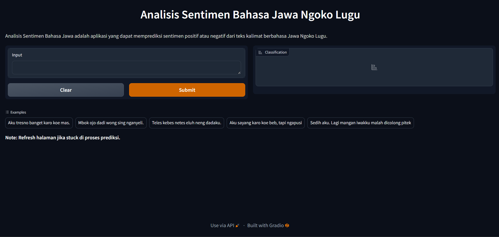

# Analisis-Sentimen-Bahasa-Jawa-IndoBERT

Moodel Deep Learning berbasis IndoBERT yang dapat memprediksi sentimen ‘positif’ atau ‘negatif’ pada teks berbahasa Jawa Ngoko Lugu. Model ini dilatih pada dataset yang diperoleh dari website Twitter/X melalui metode crawling, dan dilakukan proses pelabelan secara manual oleh peneliti. 

Model pre-trained yang digunakan pada penelitian ini adalah [IndoBERT-Base-P1](https://huggingface.co/indobenchmark/indobert-base-p1 ). Sebelum proses pelatihan model, preprocessing dataset dilakukan untuk membersihkan teks dari karakter-karakter yang tidak relevan untuk kasus analisis sentimen. 

Hasil akhir model di-upload ke [Hungging Face Hub](https://huggingface.co/docs/hub/en/index) dan di-deploy ke [Heroku](https://www.heroku.com/ ) melalui API [Hungging Face Inference Endpoins](https://huggingface.co/inference-endpoints/dedicated), yang dapat diakses melalui [Analisis Sentimen Bahasa Jawa](https://huggingface.co/azizp128/jawa-sentiment-analysis-indobert)

Penjelasan lebih detail terkait penelitian ini dapat dibaca melalui paper [Penerapan Metode Transfer Learning Pada Indobert Untuk Analisis Sentimen Teks Bahasa Jawa Ngoko Lugu](https://e-jurnal.stmikbinsa.ac.id/index.php/simkom/article/view/478).

- Playground : [Model ini merupakan model untuk analisis sentimen yang dirancang khusus untuk teks dalam bahasa Jawa Ngoko Lugu, menggunakan IndoBERT sebagai basisnya. Model ini bertujuan untuk mengidentifikasi sentimen dalam teks bahasa Jawa Ngoko Lugu, mengklasifikasikan teks tersebut sebagai positif atau negatif.Analisis Sentimen Bahasa Jawa Ngoko Lugu](https://analisis-sentimen-bahasa-jawa-9be9aaad1b5f.herokuapp.com/)
- Model on HunggingFace : [Analisis Sentimen Bahasa Jawa](https://huggingface.co/azizp128/jawa-sentiment-analysis-indobert)
- IndoBERT Pre-trained model : [IndoBERT Base Model P1](https://huggingface.co/indobenchmark/indobert-base-p1)
- Paper : [Penerapan Metode Transfer Learning Pada Indobert Untuk Analisis Sentimen Teks Bahasa Jawa Ngoko Lugu](https://e-jurnal.stmikbinsa.ac.id/index.php/simkom/article/view/478)

> [!NOTE]  
> Jika playground error, jalankan model dengan API HunggiFace melalui [Local/Google Collab](notebook/playground.ipynb)

## Screenshot

